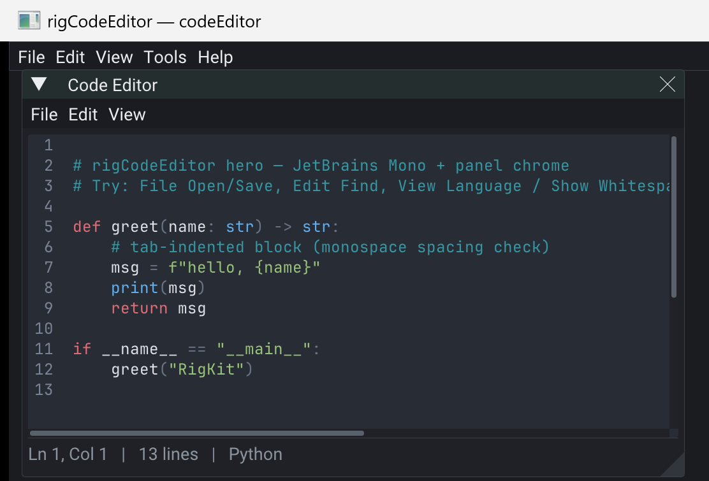

# rigCodeEditor





Shared **ImGui code editor** for RigKit tool apps — `*Editor` over [rigComponent](https://github.com/rigkid/rigComponent) `CCode` (same family as rigNodeEditor).

Every `CCode` entity becomes a Sublime-style tab; edits write back to the component. Apps can also seed the window with `getText` / `setText` (the hero does). Depends on **rigImGui** (`IMui` / `MWindow` / file dialogs / font atlas hooks).

## Features

- **TextEditor** (ImGuiColorTextEdit) + language definitions
- Panel chrome: File / Edit / View menus, find & replace (regex), open-file tabs
- Mirrors `CCode` buffers (+ optional `CAssetRef` path) and Properties light-edit
- **JetBrains Mono** Regular via `IMui::registerFontAtlasHook`
- Host dialogs through `IMui` (`std::vector<std::string>` extension filters)

## Use

```cpp
rigkit::rigCodeEditor::Options opts;
opts.windowVisible = true; // false if the app shows the window later
opts.fontSize = 14.f;
packs->registerPack(std::make_shared<rigkit::rigCodeEditor>(opts));
// after setupAll:
auto ed = ui->getWindowManager()->getWindow<rigkit::CodeEditorWindow>("Code Editor");
ed->setText(src, TextEditor::LanguageDefinitionId::Python);
ed->panel().showFind(true);
```

## Example

[examples/codeEditor](examples/codeEditor/) — dockable Code Editor with JetBrains Mono and a seeded Python sample.

```bash
cmake -S examples/codeEditor -B examples/codeEditor/build
cmake --build examples/codeEditor/build --target codeEditor
```

## Pi note

JetBrains embedded Regular (~270KB) + TextEditor are desktop-tool weight — fine for author
apps. Keep the pack opt-in via `app.json` for lean install binaries.

## License

Pack MIT. TextEditor: ImGuiColorTextEdit (MIT). JetBrains Mono: SIL OFL
(`third_party/fonts/OFL.txt`).

[API/docs](https://rigkid.github.io/rigCodeEditor/)
